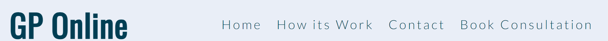

# GP Online
## Welcome Shazina Danish,

GP online is a website where, we are committed to providing exceptional healthcare service with a platform that brings together patients, GP's and pharmacies seamlessly. All of our doctors are based in Ireland and registered with the Irish Medical Council.

## What we offer:
More people are finding it difficult to take time out of their busy day-to-day lives to see their GP's or they are having to wait 7-10 days on average to for a consultation.

Healthcare is changing for the better. We at GPonline provide an online GP service that is safe, easy and discreet using our online consultation platform.

Our online platform allows our doctors to provide prescriptions, referral letters and sick notes at their discretion in a seamless manner.

## Picture of the website in different devices

## Wireframes
Wireframes were created for mobile, tablet,laptop and desktop.(https://lucid.app/lucidchart/a325f522-4f26-47cd-b215-18d64c454b19/edit?invitationId=inv_0aede0b5-4bf6-4b57-89ea-ef34ddbe5e7f)
Wireframes image here

## Features
This Usefull website presents many diferent sections for how some one book a gp phone consultation or vedio consultation after registration and signup and what includes in these consultation like "A complete GP consultation", "digital prescription" , "medical Cert" and "referral letters".
[View GP Online website on Github Page](https://github.com/Shazi-dani/GP-Online.git)

## Navigation Bar
The entire responsive navigation bar is included on all five pages and is different in each one for ease of navigation.At home page its contains Logo and links to the Home Page, How its work, Contact,Register and Sign In page.

At registration and sign In page include Logo , home page link 

and at GP phone and vedio consultation page includes Logo,Home and Registration links are available. With the help of this navigation, users will be able to move between pages on all devices without constantly pressing the "back" button to return to the previous page.

## Landing Page Main Image section
The website's landing page features a photo at right hand side and on left hand side with text to grab the user's attentions.
This part also recaps the website's objectives and introduces the user what include in this website.

## Book A Trusted Service Here Section 
The user will be able to book a Telephone Consultation or Vedio consultation here.There is two clickable links in shape of buttons that redirect the user to the respective consultation booking pages.

## How its work section
This section will allows the user to know more deeply about how user can book telephone or video consultation step by step with images.

## Whats Include section
This section will allows the user to know more about whats facilities are available in this telephone or video consultation.this section include facilities details with image and text.

## Contact Section
This section have all the information related to GP online openning and closing time, Address, customer service Phone number and email address.

## The Footer 
Links to the pertinent social media platforms are provided in the footer section. The links will open in a new tab for the user's convenience. -->
The user benefits from the footer since it encourages them to stay engaged on social media.

## Registration Page
This page will allows the user do registration through a form. After registration completion popup tab opeb which confirms registration is done and redirect user to sign in page.

## Sign In Page
This page allows the user to sign in and after sign in they can book GP consultation and do payment.

## Telephone Consultation page

This page allows the user to easily book a Telephone consultation with one of our GP. First they have to select type of consultation then choose date and time,Do payment after booking.this page also include payment page link .

## Video Consultation page
 
This page allows the user to easily book a Video consultation with one of our GP. First they have to select type of consultation then choose date and time,Do payment after booking.this page also include payment page link.

## Payment page

After booking consultation the user have to do payment through payment page.this page include payments details form.

## Features Left to Implement
* We think about improving our sites aesthetically in a near future
Technologies / Support Used like

* when user sign in it will redirect the user to a user dashboard which will have booking appointment link,payment link for doing payments and all details related to their health ,booking time date and time ,prescriptions order details, referrals letters details etc

* when user Do payment they will received an email related to their consultation date ,time and also received a questionnare.
Before we prescribe you the required medication, we would like to check if this product is suitable for you. You will be asked to fill in a short online questionnare. Once completed Based on the questionnare answer, our GP will either recommend a treatment (send a prescription directly to the pharmacy or a medical certificate directly to you, if the case) or send you a referral letter for a specialist or emergecny department for consultation, Xrays,Ultaround or Scans.

* prescripition order section for ordering prescription directlly without consultation.

## Below is a list of Technologies / Support I have used to build my site.

* HTML - is used to provide the structure and content of the website.
* CSS - is used via link to the HTML to provided style the pages.
* Java Script - is used via script at the bottom of the page for animating the pop up window  when submit a registration form.
* Code Institute lessons and the Love Running played a big role in assisting with my project.
Love Running provided the main structure and information for my Header and how its work section as well as the animation information and inspiration for the Home page , telephone/video consultation page image and form.
* Stack Overflow and w3 school - provided a lot of understanding and additional html ,css and jave script code that I had to look up in order to do the image links on the home page and understand the flex and row and column for my webpage as well as the understanding of responsive website.
* Codeanywhere - used to code within and provided backups of all my code.
* GitHub - for my repository and external project deployment.
* Google Fonts and font awesome - for my font choose for the project.
* Youtube vedios - for understanding flex,responsive website and payment details entering form.
* Lucid App - used for wireframe.(https://lucid.app/lucidchart/a325f522-4f26-47cd-b215-18d64c454b19/edit?invitationId=inv_0aede0b5-4bf6-4b57-89ea-ef34ddbe5e7f&page=0_0#)
* Google Dev Tools - To troubleshoot and test features, solve issues with responsiveness and styling.

## Testing
Testing During development of the pages was done throughout the project to see how the project looked and felt

### Manual Testing

| Feature           |  Expect              |  Action |  Result                 |
|-------------------|----------------------|---------|-------------------------|
|Header Title       |To go to Home Page    |Click On |Taken to Home Page       |
|Menu Bar           |To go to Named page   |Click On |Taken to Named Page      |
|Menue Bar          |To go to External Link|Click On |Taken to External Link   |
|Image links        |To go to Named page   |Click On |Taken to Named Page      |
|Internal links     |To go to Section      |Click On |Taken to Section of Page |
|External Links     |To go to External Link|Click On |Taken to External Link   |
|YouTube Video      |Play on request       |Click On |Plays on user request    |
|Google Map         |External if requested |Click On |External on user request |

### User Testing

+ Expectations As a user I wanted the site to

1. Understand the purpose of the site,
2. Be able to navigate easily through the site,
3. Be informed and drawn into the site,
4. Be able to seek more information.
+ Result 
As a user I was able to undersatnd how to use the site and what is the purpose of the site.

1. That the site was about Gp Online Consultation,
2. The navigation was clear and I could easily go to the information I was seeking.
3. I was informed and drawn into the site,
4. I was able to seek for more information via links and via a customer service contact information.

+ Testing done via git preview.

+ Testing of the media queries was carried out via dev tools on google chroom.

+ HTML files were tested through W3C Html validator

+ CSS file was tested through W3C Css Validator

+ Responsive design media queries tested through Am I Responsive

+ Deployed project was tested in my default browser Microsoft Edge as wells as Google Chrome and Firefox.

+ Results of Light House test below

![Light House Test](https://i.imgur.com/PgHV

# Bugs
Debugging occurred during the process of development and testing as the website was built as testing was done constantly as errors "bugs" were detected during testing I would use dev tools to see and test what would solve the particular error that occurred and fix the errors as they occurred.

# Validator Testing
* Test Validators
+ HTML - W3C Html Validator - No errors returned when pass through .
+ CSS - W3C CSS Validator - No errors returned when pass through .
+ RESPONSIVENESS - Am I Responsive for different divices media queries.
+ LIGHTHOUSE - Website tested for Performance, Accessibility, Best Practice and SEO as seen below.

# Deployment of Project
* Deployment was made possible by GitHub and Code any where
+ Initiated a repository in git : https://github.com/Shazi-dani/GP-Online
+ Setup workspace in Codeanywhere and Created all folders and files and code project
+ Go to GitHub website
+ Go to my repository in the GitHub
+ Go to Settings tab click on Select pages in the left hand navigation menu.
+ From the source dropdown select main branch and press save.
+ The site has now been deployed, please note that this process may take a few minutes before the site goes live.
+ Go to GitHub Page and linking the main root to Master Branch
Once this is done the page will automatically creat the ribbon with the http host page name that is been hosted by GitHub. The live link can be found here:(https://github.com/Shazi-dani/GP-Online.git)

# Clone Project
* Cloning of Project was made possible by GitHub
+ Go to Git Hub
+ Go to GP-Online repository https://github.com/Shazi-dani/GP-Online
+ Click on it to go to main repository site
+ Click on the Code drop down button menu next to the greeen Gippod button
+ Click on HTTP section you will see the http of the repository clikc on the window next to it it will say copied
+ Clikced on Download and Zip
+ Clicked on Open with GitHubDesktop

# Credits
* Code Institute without who I would have had no base to begin a project & Readme.md Template. https://codeinstitute.net/ie/

* GitHub for my workspace and saving all my work as well as my deployed project . https://github.com/
* Codeanywhere for my coding. https://app.codeanywhere.com/

* The Slack community - for someone always been there no matter the time and with advice or direction. https://slack.com

* Google Fonts and Font Awesome for my font choose for the project. https://fonts.google.com https://fontawesome.com
 
* Free Convert - for compressing my images for better upload time . https://www.freeconvert.com/image-compressor

* StackOverflow for all the information to assit with my project .https://stackoverflow.com

* W3C Validators both HTML and CSS to keep a check on my code. The W3C Markup Validation Service https://validator.w3.org

* I am Responsive for a fantastic spot to see a visual of responsiveness

* Lighthouse testing system.

* Google Images- for providing good quality free copyright images

* Youtube Tutorials - inspiration for responsive website,flex,Pop Up window when submitting a form.

* Lucid App - used for wireframe.(https://lucid.app/lucidchart/a325f522-4f26-47cd-b215-18d64c454b19/edit?invitationId=inv_0aede0b5-4bf6-4b57-89ea-ef34ddbe5e7f&page=0_0#)

* Copied Code / Code assistance
As stated in Technologies / Support Used I used and sort out help and code from numerous sources as well as fonts and images. However, I did exclusively get inspiration from Love running and coders coffee house for the full website. Stack over flow and Tutor Support played a huge roll in my overall development.

# Imagery for Project
Images obtained via Google image search with the free to use, modify and use license requirement on. 

# Note
All information images ,youtube video and map are for educational usage only .All care has been taken to reference and give credit to any and all information and imagery within this project. Whilst images are gained using free search with the license set for free use I have tried to trace images further they do however appear on other site's .